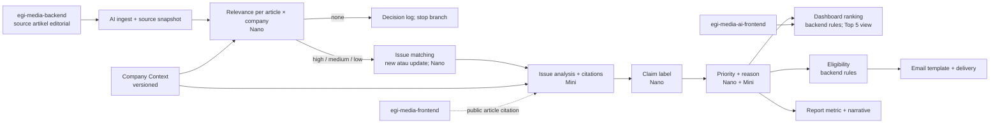
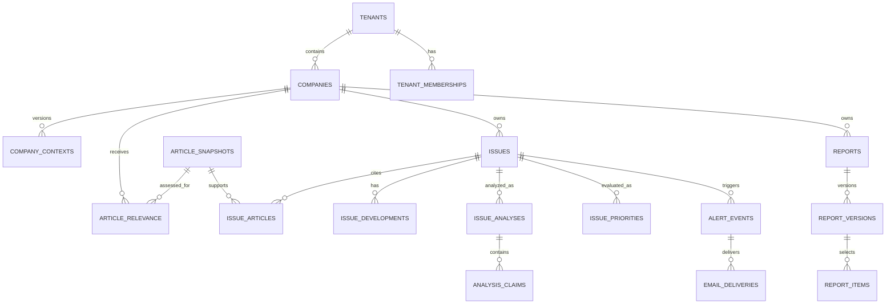

# EGI Media AI — Data Pipeline Blueprint

Status: design blueprint untuk implementasi awal  
Scope: `egi-media-ai-backend` sebagai layanan AI terpisah; belum ada source code, migration, endpoint, atau prompt production yang dibuat oleh dokumen ini.

## 1. Tujuan dan keputusan arsitektur

Produk ini adalah dashboard B2B decision-support untuk perusahaan klien EGI Media. Sistem mengambil artikel editorial yang sudah published, menilai relevansinya terhadap konteks perusahaan, membentuk serta memperbarui isu, menganalisis isu, lalu menyajikannya dalam dashboard, alert, dan laporan.

Definisi yang menjadi dasar seluruh rancangan:

> **Isu = satu topik/event bisnis untuk satu perusahaan, bisa punya banyak artikel sumber, dan diperbarui oleh perkembangan baru.**

Konsekuensinya:

- Artikel adalah source editorial; isu adalah aggregate bisnis. Satu artikel tidak otomatis menjadi satu isu.
- Relevansi artikel, prioritas isu, dan Top 5 dashboard adalah tiga proses berbeda.
- Satu artikel dapat relevan untuk company A dan B dalam tenant yang sama, tetapi menghasilkan keputusan relevance, isu, insight, dan priority yang terpisah per company.
- Top 5 hanya limit tampilan Executive Summary. Search, drawer isu, saved item, alert, dan laporan boleh memakai lebih dari lima isu.
- AI service tidak menulis balik ke CMS editorial.



## 2. System boundary dan ownership

| Sistem | Ownership | Peran di pipeline |
|---|---|---|
| `egi-media-backend` | CMS editorial | Source of truth artikel, status publikasi, content, metadata editorial. AI hanya baca. |
| `egi-media-frontend` | Portal publik | Menyediakan halaman artikel pembaca; dipakai sebagai citation URL. |
| `egi-media-ai-backend` | AI product | Own datastore, ingest, worker, prompt builder, validation, issue/insight/delivery/report API. |
| `egi-media-ai-frontend` | Dashboard B2B | Consumer API AI; tidak menyimpan prompt atau API key. |
| OpenAI API | External provider | Menjalankan task AI melalui adapter backend. |
| Email provider | External provider | Mengirim delivery intent yang sudah lolos backend gate. |

### Ownership data

| Data | Owner | Sifat di AI service |
|---|---|---|
| Artikel dan metadata editorial | CMS | Snapshot read-only; CMS tetap authority. |
| Company Context | AI product + human editor | Versioned; edit manusia menjadi effective source of truth. |
| Relevance, issue, development, analysis, priority | AI service | Tervalidasi, company-scoped, historis. |
| Ranking Top 5, eligibility, dedupe, report metrics | Backend rules | Deterministik; bukan keputusan bebas model. |
| Feedback, override, review, approval | Manusia via AI service | Diaudit; tidak ditimpa otomatis oleh model. |
| Delivery/archive laporan dan email | AI service | Menyimpan intent, status, dan provenance. |

### Tenant dan company

- `tenant_id` adalah batas isolasi keamanan antar-klien.
- `company_id` adalah entitas bisnis di dalam tenant dan basis company switcher.
- Semua record bisnis AI yang dapat dilihat user harus membawa `tenant_id`; record issue/insight/delivery/report juga membawa `company_id`.
- Company switcher mengubah konteks aktif user. Ia bukan izin akses lintas tenant atau lintas company.

## 3. Fakta integrasi CMS dan portal

### 3.1 Kontrak yang tersedia sekarang

| Dependency | Fakta dari source saat ini | Pemakaian AI |
|---|---|---|
| `GET /api/v1/articles` | Public; hanya `status = published` dan `deleted_at IS NULL`; page default 1, limit default 20, maksimum 100; sort `latest|oldest|popular`; locale `id|en|uz`. | Discovery/polling artikel. |
| List response | Membawa id, title, slug, summary, locale, status, published_at, created_at, author/category ringkas; tidak membawa full content. | Input relevance: title + summary + Company Context. |
| `GET /api/v1/articles/:id` | Public; membawa full content, translations, `updated_at`, topics/tags, status; query hanya membatasi `deleted_at IS NULL`, tidak selalu published. | Fetch evidence detail untuk analysis; AI wajib validasi ulang status published. |
| `GET /api/v1/articles/slug/:slug` | Public; detail dan query membatasi published + not deleted. | Resolusi slug bila diperlukan, bukan identity utama pipeline. |
| Article identity | UUID `articles.id`. | `source_system = egi-media-cms`, `source_article_id = UUID`; identity idempotent. |
| CMS locales | `id` primary, `en` dan `uz` optional translations. | Snapshot menyimpan locale/content yang benar-benar dipakai. |
| Portal route | Frontend memakai locale route dengan `localePrefix: always`: `/{locale}/articles/{id}`. | Citation canonical: `{portal_base_url}/{locale}/articles/{source_article_id}`; default locale dan locale sumber harus ditentukan backend. |

### 3.2 CMS dependency contract untuk AI

AI service bergantung pada kontrak berikut. Yang belum ada tidak boleh diasumsikan sudah diimplementasikan.

| Kebutuhan | Keadaan | Strategi blueprint |
|---|---|---|
| Daftar artikel published | Ada | Polling list terurut latest, paginated. |
| Detail content | Ada | Lazy fetch sebelum analysis; fetch ulang saat source version berubah. |
| Validasi published saat detail | Tidak aman pada endpoint `:id` | AI post-fetch gate: `status === published`; jika tidak, mark withdrawn/non-eligible. |
| Incremental cursor `updated_since` | Belum ada | Watermark lokal + overlap window + checksum; lihat OPEN-01. |
| Service-to-service auth | Belum ada bukti | Public read dapat dipakai untuk awal; service token direkomendasikan sebelum scale. |
| Withdrawal/unpublish event | Belum ada | Reconciliation polling; mark source withdrawn tanpa menghapus histori issue. |
| Citation URL | FE route tersedia | Konfigurasi `PUBLIC_PORTAL_BASE_URL` + `/{locale}/articles/{id}`; locale policy ditentukan backend; jangan buat URL dari output model. |

### 3.3 Source validity gate

Sebelum article snapshot menjadi input AI:

1. Response CMS berhasil dan `id` valid.
2. `status` harus `published`.
3. Artikel tidak soft-deleted atau tidak lagi tersedia.
4. Locale dan content yang dipakai dicatat eksplisit.
5. Citation URL dibangun backend dari source ID + validated locale, bukan dari LLM.
6. Snapshot memiliki checksum canonical dan source timestamp (`updated_at` bila tersedia).

Jika salah satu gagal, artikel tidak boleh menghasilkan development/analysis/alert baru. Histori lama tetap ada dan ditandai stale/withdrawn jika diperlukan.

## 4. Canonical vocabulary dan state

| Domain | Nilai / arti |
|---|---|
| `relevance` | `high`, `medium`, `low`, `none`; hubungan artikel terhadap Company Context. |
| `priority` | `tinggi`, `sedang`, `rendah`; tingkat perhatian issue berdasarkan impact, urgency, novelty, dan context. |
| `issue_status` | `baru`, `berkembang`, `dipantau`, `selesai`; state bisnis issue. Rule transisi detail perlu approval produk. |
| `period_ui` | `24jam`, `7hari`, `30hari`; filter display kumulatif, bukan type report. |
| `alert_channel` | `langsung`, `ringkasan`, `none`. |
| `report_type` | `harian`, `mingguan`, `bulanan`. |
| `report_review_status` | `draft`, `in-review`, `approved`, `shared`, `needs-review`. |
| `claim_label` | `fact`, `analysis`, `assumption`. |

Company Context terdiri dari: `name`, `industry`, `sub_industry`, `description`, `products`, `customers`, `regions`, `competitors`, `priorities`, `goals`, `risks`, `topics`, dan `dependencies`, plus metadata source/version/editor.

## 5. Pipeline operasional

### 5.1 Trigger dan granularitas

| Trigger | Memulai | Granularitas |
|---|---|---|
| Scheduled ingest | Discover artikel CMS baru/berubah | source page → article snapshot |
| Source change/new snapshot | Relevance | article × company |
| Relevance bukan `none` | Issue formation | article × company |
| Issue baru/berkembang | Analysis, claim, priority | issue × company |
| Priority/current development valid | Dashboard projection dan alert eligibility | issue × company |
| Scheduler per timezone | Digest dan reports | company × period |
| Manual replay | Reprocess stage/version tertentu | scoped aggregate |

### 5.2 Stage contract

| Stage | Input terverifikasi | Processor | Output | Gate sebelum lanjut |
|---|---|---|---|---|
| A. Ingest | CMS list/detail + watermark | Rules | source snapshot/version | Published, source ID, locale, checksum, tenant-independent source valid. |
| B. Relevance | title + summary + whitelisted Company Context | Nano `T02` | enum relevance + confidence | Schema valid. `none` disimpan lalu branch berhenti. |
| C. Match issue | relevant article + active issues company | Nano `T04` | `new|update`, candidate issue ID | Candidate ID harus issue aktif dalam company yang sama. |
| C1. Issue text | source/article + match result | Nano `T05`, `T06` (call terpisah) | title dan one-liner | Batas panjang, no invented citation. |
| D. Analysis | issue + linked article detail + context | Mini `T07` | structured insight | Semua factual source ref harus berasal dari input set. |
| D1. Claim label | validated T07 analysis | Nano `T08` | labels fact/analysis/assumption | Label schema valid; claim baru tidak boleh dibuat. |
| E. Priority | analysis + context + freshness | Nano `T09`, Mini `T10` terpisah | priority enum + reason | Rule composition valid; relevance tidak disalin sebagai priority. |
| F. Ranking | current valid issues | Rules only | Executive Summary projection | Status active, period match, priority rank, limit 5. |
| G. Alert | current issue + development + preferences | Rules; Nano `T12` hanya blurb langsung | delivery intent atau suppression | Required DB fields, dedupe, preference, source/freshness valid. |
| H. Report | validated issues/insights + backend metrics | Mini `T13` | report draft/version | Metrics backend, citations valid, review status draft. |

### 5.3 Perilaku `none`

`none` berarti artikel tidak relevan untuk company tersebut pada context version saat itu. Sistem menyimpan relevance decision, prompt/model metadata, dan source version untuk audit; sistem **tidak** membuat atau meng-update issue dari branch tersebut. Artikel masih dapat relevan untuk company lain.

### 5.3.1 Status `low` dalam issue formation

Blueprint teknis saat ini mengizinkan `low` melewati relevance gate dan masuk kandidat issue matching. Ini adalah baseline teknis yang menjaga informasi tidak terbuang sebelum keputusan bisnis selesai. Produk masih OPEN untuk memutuskan apakah hasil `low` dibuatkan issue atau hanya disimpan sebagai relevance decision. Engineering tidak boleh mengubah baseline ini menjadi hard drop secara diam-diam.

### 5.4 Issue baru, update, dan selesai

- Candidate matching hanya mengambil issue aktif (`baru`, `berkembang`, `dipantau`) dalam tenant/company yang sama dan window kebaruan awal sekitar tujuh hari.
- `new` membuat issue company-scoped, relation issue–article, dan development pertama.
- `update` menambah relation article, membuat development baru, memperbarui `last_developed_at`, dan memicu reanalysis.
- Issue `selesai` tidak menjadi candidate update otomatis. Default engineering saat ini adalah **issue baru**, agar arsip selesai tidak berubah diam-diam; apakah produk mengizinkan `reopen` tetap merupakan keputusan OPEN.
- Merge/split/close/reopen adalah human override yang diaudit.

### 5.5 Analysis, priority, dan dashboard

Analysis selalu per issue, menggunakan seluruh evidence artikel yang linked dan Company Context version yang berlaku. Analysis dijalankan ulang ketika issue baru atau memiliki development baru yang valid; bukan hanya karena issue masuk/keluar Top 5.

Priority baru dibuat setelah analysis. Dashboard menghitung ranking secara backend:

```text
issue.status IN (baru, berkembang, dipantau)
AND issue.company_id = active company
AND ada development dalam period UI
ORDER BY priority (tinggi, sedang, rendah), last_developed_at DESC, id ASC
LIMIT 5
```

Search, detail issue, report, dan saved item tidak memakai `LIMIT 5` ini.

## 6. Model/task contract dan trust boundary

| Task | Tujuan tunggal | Model | Input whitelist | Output minimum |
|---|---|---|---|---|
| `T01_company_context_draft` | Draft Company Context | Mini | URL/file text tervalidasi | 12-field map |
| `T02_relevance_class` | Klasifikasi relevance | Nano | title, summary, context | enum + confidence |
| `T03_relevance_rationale` | Alasan relevance | Nano | input T02 + result | short rationale |
| `T04_issue_match` | New vs update | Nano | article ringkas + candidate list | decision, candidate ID/null |
| `T05_issue_title` | Judul issue | Nano | article + decision | title |
| `T06_issue_oneliner` | One-liner issue | Nano | article + title | one-liner |
| `T07_issue_analysis` | Insight issue | Mini | issue evidence + context | what/why/impact/risk/watch |
| `T08_claim_labels` | Label claim | Nano | T07 output | labels |
| `T09_priority_enum` | Priority enum | Nano | analysis + context | priority |
| `T10_priority_reason` | Alasan priority | Mini | analysis + T09 | reason |
| `T12_direct_blurbs` | Dua blurb email langsung | Nano | validated issue/development | bounded text |
| `T13_report_narrative` | Narasi laporan | Mini | selected issue pack + metrics | sections |
| `T14_constrained_rewrite` | Rewrite terbatas | Nano | human instruction + allowed span | revised span |

Aturan tetap:

- Satu task = satu objective. Tidak ada mega-prompt classify + summarise + analyze.
- Nano dipakai untuk task sempit/volume tinggi; Mini untuk synthesis/analysis/report/context yang mendalam.
- Model tidak memilih task, tool, recipient, tenant/company, status, priority ranking, atau email send.
- Prompt dikelola backend, versioned, dan dibangun dengan field whitelist.
- Artikel, file/URL context, feedback, dan model output adalah untrusted data. Delimiter membantu, tetapi authorization dan validator backend tetap authority.

## 7. Validation dan failure policy

Setiap output model melewati empat validator sebelum menjadi current state:

1. **Schema validation**: required property, type, enum, length, JSON structure.
2. **Business validation**: state transition, relevance gate, priority rule, alert policy, duplicate relation, required fields.
3. **Source validation**: citation/source ID harus berasal dari evidence input dan scope company/tenant benar.
4. **Safety validation**: no secret/PII tidak perlu, no untrusted instruction execution, no unsupported external action.

| Failure | Behaviour |
|---|---|
| CMS timeout/5xx/429 | Retry bounded with backoff; preserve watermark/checkpoint. |
| Provider timeout/5xx/429 | Retry idempotently; persist attempt and correlation ID. |
| Invalid JSON/schema | Mark stage failed; no downstream state/email; retry hanya jika policy memungkinkan. |
| Citation invalid | Reject analysis/current version; no alert/report external action. |
| Business validation fail | Persist failure/audit; do not retry blindly. |
| Data insufficient | Persist explicit `insufficient_data`; no fabricated conclusion. |
| Delivery timeout | Keep delivery intent pending and reconcile; do not send duplicate blindly. |
| Source withdrawn | Mark source withdrawn/stale; preserve history and stop new delivery from invalid evidence. |

Stale previous analysis boleh ditampilkan sebagai historical state dengan timestamp, tetapi tidak boleh dipakai sebagai bukti bahwa ada perkembangan baru dan tidak boleh memicu email baru.

## 8. Alert, email, dan report policy

### 8.1 Eligibility

| Condition | Action |
|---|---|
| `tinggi` + issue baru atau update material | `langsung` |
| `sedang` + development baru | `ringkasan` harian |
| `rendah`, atau tanpa development baru | `none`; dashboard saja |

Priority tinggi tanpa development baru tidak mengirim ulang email. Definisi formal `update material` masih OPEN dan tidak boleh dikarang oleh engineering.

Eligibility alert diimplementasikan sebagai backend rules: priority, development state, material-update decision, preference, quiet hours, rate limit, dan dedupe. Tidak ada task Nano yang memilih channel alert. Nano hanya boleh menghasilkan direct-alert blurb setelah eligibility rules memutuskan bahwa delivery boleh dipertimbangkan.

### 8.2 Delivery gate

Sebelum email provider dipanggil, backend wajib memastikan:

- issue/current analysis valid dan tidak stale;
- tenant/company/recipient/preference sesuai;
- event memiliki development baru dan dedupe key belum pernah terkirim;
- title, priority, one-liner, detail URL, dan citation tersedia dari data tersimpan;
- untuk direct alert, blurb Nano lolos schema/source validation;
- template tetap dibuat backend; Mini tidak menulis email operasional;
- jika field wajib kosong/invalid, delivery fail-closed.

`alert_event` menyimpan keputusan eligibility/suppression. `email_delivery` menyimpan intent, template version, provider reference, retry, dan outcome supaya inbox AI frontend tidak bergantung pada mailbox provider.

### 8.3 Reports

| Jenis | Selection | Narasi | Review |
|---|---|---|---|
| Harian | Development baru pada ~24 jam; fokus tinggi/sedang | Mini | Draft → review |
| Mingguan | Issue aktif pada minggu berjalan; boleh lebih dari Top 5 | Mini + backend WoW metric | Review/approve/share |
| Bulanan | Tren bulanan dan MoM metrics | Mini + backend aggregate | Review/approve/share |

Laporan memakai issue + insight + priority yang tervalidasi, bukan rangkuman artikel mentah. Hanya report `approved` yang boleh di-share. Edit report approved membuat version baru dan kembali ke `needs-review`/review flow; edit manusia menjadi effective source of truth.

## 9. Data model dan physical schema

PostgreSQL AI datastore dipisah dari database/tabel CMS. Ia boleh berada pada PostgreSQL server yang sama, tetapi ownership database dan migration berbeda.

### 9.1 Entity relationship



### 9.2 Table contract

| Table | Required columns | Constraint/index rationale |
|---|---|---|
| `tenants` | `id`, `name`, `status`, timestamps | Tenant root. |
| `companies` | `id`, `tenant_id`, `name`, `status`, timestamps | Unique `(tenant_id, name)`; index tenant. |
| `tenant_memberships` | `id`, `tenant_id`, `user_ref`, `role`, `status`, timestamps | Unique `(tenant_id, user_ref)`; user auth reference. |
| `company_memberships` | `id`, `tenant_id`, `company_id`, `user_ref`, `role`, timestamps | Unique `(company_id, user_ref)`; validate company belongs tenant. |
| `company_contexts` | `id`, `tenant_id`, `company_id`, `version`, `content_jsonb`, `source`, `status`, `updated_by`, timestamps | Unique `(company_id, version)`; one current effective version by partial index. |
| `company_context_sources` | `id`, `context_id`, `source_type`, `locator`, `content_hash`, validation status | Provenance for URL/file/manual input. |
| `article_snapshots` | `id`, `source_system`, `source_article_id`, `locale`, title/summary/content, metadata JSONB, `source_status`, `source_published_at`, `source_updated_at`, `content_hash`, `ingested_at`, `withdrawn_at` | Unique `(source_system, source_article_id, locale, content_hash)`; index source ID/current freshness. |
| `article_relevance` | `id`, `tenant_id`, `company_id`, `article_snapshot_id`, `context_id`, relevance, confidence, rationale, validation/model metadata | Unique effective decision per `(company_id, article_snapshot_id, context_id)`; index company/relevance. |
| `issues` | `id`, `tenant_id`, `company_id`, title, one_liner, status, current_priority, `first_seen_at`, `last_developed_at`, `version`, timestamps, `closed_at` | Index dashboard `(company_id, status, current_priority, last_developed_at DESC)`. |
| `issue_articles` | `id`, `tenant_id`, `company_id`, `issue_id`, `article_snapshot_id`, `attached_at`, `relation_status` | Unique `(issue_id, article_snapshot_id)`; prevents duplicate evidence. |
| `issue_developments` | `id`, `tenant_id`, `company_id`, `issue_id`, `article_snapshot_id`, `development_type`, `observed_at`, `is_material nullable`, validation/run refs | Index `(issue_id, observed_at DESC)`. `is_material` remains nullable until product definition approved. |
| `issue_analyses` | `id`, `tenant_id`, `company_id`, `issue_id`, `input_fingerprint`, `analysis_jsonb`, status, model/prompt/schema metadata, `valid_at`, timestamps | Unique `(issue_id, input_fingerprint, prompt_version)`; history, not in-place overwrite. |
| `analysis_claims` | `id`, `analysis_id`, label, claim text, source refs JSONB, validation status | Each fact must reference linked input article source. |
| `issue_priorities` | `id`, `tenant_id`, `company_id`, `issue_id`, priority, reason, `rule_version`, analysis ref, `effective_at`, `superseded_at` | Index current priority per company; history supports ranking audit. |
| `pipeline_runs` | `id`, `trigger`, `tenant_id nullable`, `company_id nullable`, `source_ref`, `status`, `idempotency_key`, `trace_id`, attempts/timestamps/error class | Unique scoped idempotency key; recovery/replay evidence. |
| `stage_runs` | `id`, `pipeline_run_id`, task/stage, input fingerprint, output JSONB, validation status, model/prompt/provider metadata, attempts/timing | Provenance per model/rules stage. |
| `alert_preferences` | `id`, `tenant_id`, `company_id`, `user_ref`, high/digest flags, timezone, quiet-hours JSONB, timestamps | Unique `(company_id, user_ref)`. |
| `alert_events` | `id`, `tenant_id`, `company_id`, `issue_id`, development ref, channel, eligibility reason, `dedupe_key`, status, timestamps | Unique `dedupe_key`; audit send/suppress decision. |
| `email_deliveries` | `id`, `alert_event_id nullable`, `report_id nullable`, recipient ref/hash, template/version, payload JSONB, status, provider message ref, attempt/error/sent/read times | One parent type required; provider idempotency/reconciliation. |
| `reports` | `id`, `tenant_id`, `company_id`, type, period start/end, timezone, review status, current version ref, timestamps | Unique `(company_id, type, period_start, period_end)`; index company/period. |
| `report_versions` | `id`, `report_id`, version, content JSONB, metrics JSONB, model/prompt metadata, review status, author ref, timestamps | Unique `(report_id, version)`; immutable approved history. |
| `report_items` | `id`, `report_version_id`, `issue_id`, section, rank, inclusion reason | Explicit report selection/provenance. |
| `feedback` | `id`, `tenant_id`, `company_id`, `user_ref`, target type/id, feedback type, payload, created_at | Advisory; no automatic learning in initial scope. |
| `human_overrides` | `id`, `tenant_id`, `company_id`, target type/id, prior/new JSONB, reason, actor ref, status, timestamps | Human decision, version checked, audited. |
| `audit_events` | `id`, `tenant_id`, `company_id nullable`, actor type/ref, action, target type/id, redacted metadata JSONB, `trace_id`, created_at | Append-only logical audit; index scope/target/time. |

### 9.3 Required database rules

- All timestamps are `timestamptz` stored in UTC. User/company timezone is a schedule/presentation attribute.
- UUID is primary identity. CMS UUID is stored as external source ID, not reused as AI aggregate ID.
- `tenant_id` is mandatory on tenant-owned records. `company_id` is mandatory on company business records.
- Parent-child scope is verified by FK plus application-layer tenant predicate; no query relies on ID alone.
- Current rows use optimistic `version`/conditional update for issue, context, report, and override mutation.
- Snapshot, analysis, priority, report version, delivery attempt, and audit history are append-only logically.
- JSONB requires explicit schema version and server-side validation; query/ranking/security fields remain relational.
- No partitioning is required for v0.05. Reassess `stage_runs`, `audit_events`, and delivery history after actual volume measurement.

## 10. Worker, queue, and idempotency contract

| Queue / job | Trigger | Payload identity | Idempotency boundary |
|---|---|---|---|
| `ingest-articles` | Scheduler/manual backfill | source page + watermark/run | source article + locale + source hash |
| `evaluate-relevance` | New source snapshot | snapshot + tenant/company + context version | snapshot × company × context |
| `match-issue` | relevance != none | snapshot + company + relevance version | issue attach decision per snapshot/company |
| `analyse-issue` | new/update development | issue + evidence fingerprint + context version | issue input fingerprint + prompt version |
| `evaluate-priority` | valid analysis | issue + analysis version | issue analysis version + rule version |
| `dispatch-alert` | eligible direct event / digest schedule | alert event + recipient policy | delivery dedupe key |
| `generate-report` | period scheduler/manual | company + report type + period | company/type/period/version |
| `reconcile-source` | scheduled | source ID/watermark | current source status/version |
| `replay-stage` | authorized operator | target stage + input version | replay request ID; no in-place overwrite |

AI queues must be isolated from existing CMS email queue. BullMQ/Redis is compatible with existing backend stack, but service namespace, credentials, dead-letter handling, and metrics must be separate.

Every job payload includes `trace_id`, `tenant_id`/`company_id` when applicable, aggregate/source ID, input version/fingerprint, task/stage name, attempt, and idempotency key. Worker revalidates scope and input freshness before prompt assembly.

## 11. AI service API contract

This is the API surface expected by AI frontend. Names are proposed implementation contract for the separate service; they do not modify CMS routes.

| Method | Path | Purpose | Scope/notes |
|---|---|---|---|
| `GET` | `/api/v1/dashboard/executive-summary` | Current Top 5 projection | company required/active; `period=24jam|7hari|30hari`. |
| `GET` | `/api/v1/issues` | Browse/search issues | company-scoped; filters priority/status/period; not limited to 5. |
| `GET` | `/api/v1/issues/:issueId` | Issue detail/timeline/insight/citations | Must belong to tenant/company scope. |
| `POST` | `/api/v1/issues/:issueId/saved` | Save issue | User-scoped preference. |
| `DELETE` | `/api/v1/issues/:issueId/saved` | Remove saved issue | User-scoped preference. |
| `GET` | `/api/v1/inbox/emails` | Alert/digest archive | Recipient + company scoped. |
| `PATCH` | `/api/v1/inbox/emails/:emailId/read` | Mark inbox item read | Does not affect alert eligibility. |
| `GET` | `/api/v1/reports` | List reports | company/type/period filter. |
| `GET` | `/api/v1/reports/:reportId` | Read current approved/draft projection | Role/review scope checked. |
| `POST` | `/api/v1/reports/:reportId/review` | Submit review command | Human action, version required. |
| `POST` | `/api/v1/reports/:reportId/approve` | Approve current version | Human role required. |
| `POST` | `/api/v1/reports/:reportId/share` | Share approved report | Human role required; external action gate. |
| `GET` | `/api/v1/companies/:companyId/context` | Read effective Company Context | Company membership required. |
| `PUT` | `/api/v1/companies/:companyId/context` | Create context version | Human edit/version check. |
| `POST` | `/api/v1/company-context/draft` | Request async T01 draft | URL/file handling security gate. |
| `POST` | `/api/v1/feedback` | Submit feedback | No automatic learning in initial version. |
| `POST` | `/api/v1/internal/runs/:runId/replay` | Internal replay | Service/operator only, audited. |

API rules:

- User auth, tenant/company authorization, and active-company validation occur before query or prompt context assembly.
- Reads return only validated/current projections. Raw provider output, prompt text, API key, unvalidated output, and other tenant records are never exposed.
- Mutating command uses `Idempotency-Key`; versioned resources require `If-Match` or body `version`.
- List response follows `data.items` + `data.meta`; error response uses stable code/message and request/trace ID.
- `404` must not leak existence of out-of-scope resources; return safe 404/403 policy consistently.

## 12. Security, observability, and QA

### 12.1 Security controls

| Risk | Required control |
|---|---|
| Secret exposure | OpenAI key only in backend env/secret store; never frontend, logs, prompt, or response. |
| Prompt injection | Article/context/file/URL/user input treated as untrusted data; structured delimiter, whitelist, system policy backend-only. |
| Indirect injection | URL/file validation, content extraction isolation, allowlist/redirect policy, malware scanning before model use. |
| Cross-tenant leakage | Tenant predicate before retrieval/prompt, scoped cache key, scoped queue payload, tenant-aware audit. |
| Cross-company leakage | Company predicate on issue/context/analysis/report/delivery; same article has separate company branch. |
| Excessive agency | Model cannot approve, send, write CMS, choose recipient, or invoke arbitrary tool. |
| Invalid external action | Fail-closed email/share gate and delivery intent/audit. |
| Sensitive logs | Redact PII, provider credential, raw prompt, unneeded source body; retain trace metadata. |

### 12.2 Metrics and operations

- Ingest: pages/articles fetched, eligible/withdrawn, checkpoint lag, CMS latency/error/retry.
- AI: relevance distribution, issue new/update rate, schema/business/source validation failure, analysis latency, token/cost by task/model/tenant.
- Product: priority distribution, Top 5 churn, alert eligibility/suppression/dedupe, report generation/review duration.
- Reliability: queue lag, retry/DLQ count, provider errors, delivery unknown/bounce rate, replay count.
- Security: cross-scope denial, injection attempt, sensitive-output redaction, operator access.

Every API request, pipeline run, stage run, provider call, delivery event, and human override carries a correlated `trace_id`.

### 12.3 Minimum acceptance tests

| Test | Pass condition |
|---|---|
| Idempotent ingest | Repeating same page/article hash creates no duplicate snapshot/evidence. |
| Multi-company same source | Article can be relevance `high` for A and `none` for B without data mixing. |
| `none` gate | No issue/development/analysis follows a none relevance result. |
| Issue update | New article attaches to existing active issue and reruns analysis; does not duplicate issue. |
| Finished issue | Match to `selesai` does not silently reopen/archive-mutate. |
| Ranking | Fifteen high issues show five by deterministic order; search exposes the rest. |
| Citation | Unknown article ID/URL in analysis causes validation failure. |
| Email fail-closed | Missing DB field, invalid blurb, stale analysis, or no development creates no provider send. |
| Cross tenant/company | Query, prompt, cache, queue, report, and recipient have no leakage. |
| Prompt regression | Golden fixture preserves valid schema/citation/relevance/priority behavior after prompt/model change. |

## 13. Open decisions and implementation dependencies

| ID | Decision/dependency | Owner |
|---|---|---|
| OPEN-01 | CMS incremental feed: `updated_since`/cursor or formal watermark semantics. | CMS/backend |
| OPEN-02 | Definition of material update and whether high priority alone can re-alert. | Product |
| OPEN-03 | Issue match/merge taxonomy outside initial seven-day candidate window. | Product + analyst |
| OPEN-03A | Whether `low` relevance is allowed to create an issue or only remains a relevance decision. | Product |
| OPEN-04 | Strict citation failure policy: reject whole analysis vs strip unsupported claims. | Product + AI engineering |
| OPEN-05 | Human review gate for direct email and final report share. | Product + security |
| OPEN-06 | RBAC matrix and cross-company visibility in a tenant. | Product + security |
| OPEN-07 | Exact payload handoff/versioning across T02→T07 and T09→T10. | AI engineering |
| OPEN-08 | Company Context URL/file allowlist, size/page limit, scanning, and retention. | Security + operations |
| OPEN-09 | Provider data/retention policy, email provider, quiet hours/rate limits. | Security + operations |
| OPEN-10 | Withdrawn/unpublished source behavior for existing citation/report/history. | Product + CMS/backend |
| OPEN-11 | Numeric retry, cost, latency, retention, and partitioning thresholds. | Operations + data |
| OPEN-12 | Feedback learning activation. | Product; explicitly deferred initially |

## 14. Evidence used

- `egi-media-ai-backend/AI-Dashboard-Blueprint-Highlevel.md`: product direction, model split, issue/relevance/priority/Top 5, alert/report policy.
- `egi-media-ai-backend/AI-Dashboard-Technical-Detail.md`: stage task catalog, domain draft, worker outline, validation and OPEN items.
- `egi-media-backend/src/routes/article.js`, article handler/query/domain/validator/migrations: actual route, filters, fields, locales, detail-by-ID published gap, and editorial schema.
- `egi-media-frontend/src/i18n/routing.ts`, `src/app/[locale]/articles/[slug]/page.tsx`, `src/shared/constants/api.constants.ts`, `src/shared/utils/article-path.ts`, article repository: locale-prefixed public route, canonical share URL, and API consumption facts.
- `egi-media-ai-frontend/Standard-System-Prompt-untuk-Aplikasi-AI.md`: backend-only prompt ownership, untrusted input, validation, tenant isolation, security, versioning, testing, audit, and provider independence.

## 15. Implementation boundary

This blueprint is ready to guide implementation planning. Before implementation, resolve the relevant OPEN items—especially material update, RBAC, CMS incremental/withdrawal contract, citation failure policy, and external delivery review gate. No item in this document authorizes treating an LLM output as a business decision or external action without backend validation and required human approval.
