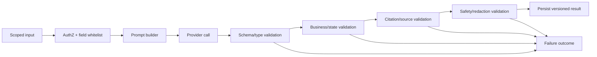

# EGI Media AI — Prompting Best-Practice Contract

Status: design contract sebelum implementasi prompt production  
Authority: `Standard-System-Prompt-untuk-Aplikasi-AI.md` + `AI-Dashboard-Blueprint-Highlevel.md` + `AI-Dashboard-Technical-Detail.md`

## 1. Tujuan

Dokumen ini mengunci cara AI service menggunakan model OpenAI untuk pipeline EGI Media. Ini bukan kumpulan prompt final; ini adalah kontrak yang menentukan task, objective, data yang boleh masuk, output yang boleh keluar, validasi, dan perilaku gagal.

Prinsip utama:

- Satu panggilan model memiliki satu objective.
- Prompt hanya dirakit dan disimpan di backend AI service.
- Model output adalah untrusted sampai lolos validator backend.
- Tenant/company authorization terjadi sebelum data masuk prompt.
- Artikel, dokumen, URL, feedback, dan output model lain diperlakukan sebagai untrusted data.
- Model tidak boleh memutuskan action eksternal, ranking Top 5, recipient, authorization, atau menulis CMS.

## 2. Prompt architecture

Setiap request ke provider dibentuk oleh backend dalam urutan tetap:

```text
1. System policy            — aturan tetap keamanan, scope, dan refusal
2. Task contract            — satu objective + task-specific business rules
3. Trusted application data — IDs, enum, state, selected context yang tervalidasi
4. Untrusted source data    — artikel, URL/file text, feedback; hanya sebagai data
5. Output schema            — JSON schema task
6. Provider config          — model, timeout, token/length budget
```

Semua section dipisahkan delimiter eksplisit. Contoh struktur konseptual:

```text
<SYSTEM_POLICY>...</SYSTEM_POLICY>
<TASK_CONTRACT id="T02_relevance_class@1.0.0">...</TASK_CONTRACT>
<TRUSTED_CONTEXT>...</TRUSTED_CONTEXT>
<UNTRUSTED_ARTICLE_DATA>...</UNTRUSTED_ARTICLE_DATA>
<OUTPUT_SCHEMA>...</OUTPUT_SCHEMA>
```

Isi di dalam `<UNTRUSTED_...>` tidak boleh mengubah system policy, task, schema, tenant, company, tool, atau delivery decision.

## 3. Trusted dan untrusted data

| Kategori | Boleh diperlakukan sebagai | Contoh EGI Media | Aturan |
|---|---|---|---|
| Trusted application data | Bounded context | validated tenant/company ID, Company Context version, selected issue ID, canonical enum, source ID set, backend metrics, current state | Tetap di-whitelist; tidak kirim seluruh record. |
| Trusted source metadata | Evidence terbatas | CMS article ID, status published, locale, timestamp, canonical citation URL, hash | Hanya setelah CMS source gate lolos. |
| Untrusted article content | Data/evidence | title, summary, content, tag, author text | Artikel dapat berisi prompt injection; bukan instruksi. |
| Untrusted Company Context input | Data untuk T01 | URL content, file text, pasted company profile | Validasi file/URL sebelum masuk model; human edit menjadi SoT. |
| Untrusted user input | Intent terbatas | feedback, rewrite request, search phrase | Validasi request schema; jangan diteruskan sebagai system instruction. |
| Untrusted model output | Kandidat result | relevance, insight, blurb, report narrative | Tidak masuk current state sebelum validation. |

Field yang tidak boleh masuk prompt: API key, token/session, password/hash, raw user email jika tidak perlu, internal database connection, unscoped tenant/company records, full audit log, arbitrary tool definition, dan prompt production lain.

## 4. Prompt registry dan lifecycle

Setiap prompt disimpan sebagai immutable version dengan metadata berikut:

```json
{
  "prompt_id": "T02_relevance_class",
  "version": "1.0.0",
  "status": "draft|review|approved|active|deprecated|archived",
  "owner": "ai-engineering",
  "model_compatibility": ["gpt-5-nano-2025-08-07"],
  "input_schema_version": "1.0",
  "output_schema_version": "1.0",
  "change_summary": "...",
  "approved_by": null,
  "rollback_version": null
}
```

Hanya versi `active` boleh dipakai. Perubahan objective, schema, citation behavior, model compatibility, atau business rule membuat versi baru. Setiap run menyimpan `prompt_id`, `prompt_version`, model, provider request correlation, input fingerprint, token, latency, dan validation outcome—bukan secret atau raw prompt secara default.

## 5. Task catalog

| Task | Objective tunggal | Model | Trigger | Tidak boleh dilakukan |
|---|---|---|---|---|
| `T01_company_context_draft` | Menstrukturkan draft Company Context | Mini | onboarding/settings context source | Meng-approve context, mengakses domain/tool lain, atau menentukan tenant. |
| `T02_relevance_class` | Klasifikasi relevance satu article × company | Nano | valid article snapshot | Membuat issue, priority, atau summary. |
| `T03_relevance_rationale` | Memberi alasan singkat atas label relevance | Nano | T02 valid bila UI/audit membutuhkan | Mengubah label relevance. |
| `T04_issue_match` | Memilih `new` atau `update` terhadap candidate active issue | Nano | relevance != none | Membuat candidate ID baru atau memilih issue lintas company. |
| `T05_issue_title` | Membuat judul issue | Nano | T04 valid | Memutuskan match atau priority. |
| `T06_issue_oneliner` | Membuat one-liner issue | Nano | T04/T05 valid | Menulis analysis atau email. |
| `T07_issue_analysis` | Menyusun insight per issue | Mini | new/update issue with evidence pack | Memberi priority, delivery decision, atau claim label. |
| `T08_claim_labels` | Label setiap claim yang sudah ada | Nano | T07 valid | Menambah/menghapus/rewrite claim. |
| `T09_priority_enum` | Menghasilkan enum priority | Nano | analysis valid | Meranking Top 5 atau membuat alasan panjang. |
| `T10_priority_reason` | Menulis alasan priority | Mini | T09 valid + analysis | Mengubah enum priority. |
| `T12_direct_blurbs` | Menulis bounded blurb email langsung | Nano | rules telah memilih direct alert | Memilih channel/recipient atau menulis email lengkap. |
| `T13_report_narrative` | Menulis narasi report dari selected issue pack/metrics | Mini | report draft | Menghitung metric atau approve/share report. |
| `T14_constrained_rewrite` | Rewrite hanya span yang diizinkan manusia | Nano | user action + allowed span | Mengubah factual basis/section lain. |

Tidak ada `T11` untuk alert channel: eligibility adalah **rules-only**. Model tidak boleh mengisi definisi `material update` yang masih OPEN.

## 6. Input whitelist dan output contract per task

### T01 — Company Context draft

| Elemen | Contract |
|---|---|
| Trusted input | company ID opaque, allowed context fields, extraction language, size/page limits, source metadata. |
| Untrusted input | Sanitized text dari URL/file/manual paste. |
| Output | `name`, `industry`, `sub_industry`, `description`, `products`, `customers`, `regions`, `competitors`, `priorities`, `goals`, `risks`, `topics`, `dependencies`, `missing_fields`. |
| Citation | Setiap field non-trivial membawa `source_locator` dari source input; tidak membuat URL/file ID baru. |
| Gate | Schema, field length, only allowed field names, source locator in supplied set, no hidden instruction. |
| Failure | `insufficient_data` bila source terlalu sedikit; `invalid_output` bila schema/citation gagal; tidak membuat effective context. |

```json
{
  "status": "complete|insufficient_data",
  "context": {
    "name": "string|null",
    "industry": "string|null",
    "sub_industry": "string|null",
    "description": "string|null",
    "products": ["string"],
    "customers": ["string"],
    "regions": ["string"],
    "competitors": ["string"],
    "priorities": ["string"],
    "goals": ["string"],
    "risks": ["string"],
    "topics": ["string"],
    "dependencies": ["string"]
  },
  "field_sources": [{"field": "industry", "source_locator": "allowed-source-id"}],
  "missing_fields": ["string"]
}
```

### T02 and T03 — Relevance

| Elemen | T02 classification | T03 rationale |
|---|---|---|
| Trusted input | article snapshot ID, validated locale, Company Context version and whitelisted fields, allowed enums | T02 result, same allowed article/context refs |
| Untrusted input | article title + summary | article title + summary |
| Output | relevance enum + confidence signal | bounded rationale |
| Citation | No free URL; article source ID is implicit input reference | May reference only input article ID |
| Gate | Enum valid; confidence 0–1; one row per snapshot×company×context | T02 must be valid; text length and source ID valid |
| Failure | schema fail → no issue branch; insufficient article summary → `insufficient_data` | optional task may be omitted; does not change T02 |

```json
{"relevance":"high|medium|low|none","confidence":0.0}
```

### T04, T05, T06 — Issue formation

| Elemen | T04 match | T05 title | T06 one-liner |
|---|---|---|---|
| Trusted input | article snapshot ID, company ID, candidate active issues `{id,title,one_liner,last_developed_at}` | T04 decision + article evidence | T04/T05 result + article evidence |
| Untrusted input | article title, summary, bounded excerpt | same | same |
| Output | `decision`, `candidate_issue_id|null`, `reason_code` | title | one-liner |
| Citation | candidate ID must belong to input candidate set | article ID only | article ID only |
| Gate | candidate ID is valid active issue in same tenant/company; `new` requires null ID | max length, no source invention | max length, no unsupported factual detail |
| Failure | schema/business fail → manual/retry policy; no issue mutation | issue stays without generated title and requires retry/review | title can remain current; no alert based only on failed one-liner |

```json
{"decision":"new|update","candidate_issue_id":"uuid|null","reason_code":"same_event|new_event|insufficient_data"}
```

### T07 and T08 — Issue analysis and claim labels

| Elemen | T07 analysis | T08 labels |
|---|---|---|
| Trusted input | issue ID, Company Context version, input article ID set, canonical locale-aware URLs, source timestamps | immutable T07 analysis JSON + claim IDs |
| Untrusted input | title/summary/content of linked articles | T07 text only, treated as candidate content |
| Output | what happened, why matters, impacts, risks, watch, claims | label per existing claim |
| Citation | Every factual claim references one or more allowed article IDs; URL must be backend canonical URL for that ID/locale | label retains claim ID; cannot add citation/claim |
| Gate | claim source IDs subset of input set; no unsupported fact; source URL exact canonical value; array/count/length limits | exactly one label per T07 claim ID; enum `fact|analysis|assumption` |
| Failure | invalid citation/schema → analysis not current; no priority/alert/report from it | T07 remains non-deliverable until labels succeed or human review policy approves |

```json
{
  "what_happened": "string",
  "why_matters": "string",
  "impacts": [{"text":"string","source_article_ids":["uuid"]}],
  "risks": [{"text":"string","source_article_ids":["uuid"]}],
  "watch": [{"text":"string","source_article_ids":["uuid"]}],
  "claims": [{"claim_id":"c1","text":"string","source_article_ids":["uuid"]}]
}
```

### T09 and T10 — Priority

| Elemen | T09 enum | T10 reason |
|---|---|---|
| Trusted input | validated analysis version, Company Context version, freshness/development flags, priority rubric | T09 valid enum + validated analysis/context |
| Untrusted input | none beyond content embedded in validated analysis; raw article is not resent | same |
| Output | `tinggi|sedang|rendah` | bounded reason + source claim IDs |
| Citation | N/A for enum; backend stores analysis ref | source claim IDs must exist in T07/T08 validated set |
| Gate | priority enum valid; backend rules validate state/freshness and preserve separation from relevance | length/source-claim validation; cannot alter T09 enum |
| Failure | no dashboard priority update/alert eligibility | enum can remain valid but reason is absent; no direct email requires reason unless product permits |

### T12 — Direct-alert blurb

| Elemen | Contract |
|---|---|
| Precondition | Backend rules already selected `langsung`, found a qualifying new/material development, passed preference/dedupe/quiet-hour gate. |
| Trusted input | issue title, priority, current validated one-liner, relevant source claim IDs, canonical detail URL, bounded development facts. |
| Untrusted input | none beyond text within already validated analysis/development fields. |
| Output | `new_development_blurb`, `short_impact_blurb`, `source_claim_ids`. |
| Citation | source claim IDs subset of supplied validated claim IDs; model cannot generate a link/recipient/subject. |
| Gate | maximum length, no prohibited claim, source IDs valid, no empty DB-required field. |
| Failure | **fail closed**: no email provider call. Alert event becomes `blocked_invalid_content` or `needs_review`. |

### T13 — Report narrative

| Elemen | Contract |
|---|---|
| Trusted input | report type/period/timezone, backend metrics, selected issue/analysis/priority/report-item IDs, canonical citations, Company Context version. |
| Untrusted input | no raw full article by default; only validated issue pack. |
| Output | executive summary, issue narrative, impact narrative, watch items, source references. |
| Citation | every source reference maps to selected issue claim/article ID; report cannot cite arbitrary URL. |
| Gate | period/metric consistency, source subset, section length, no unselected issue, report review status draft. |
| Failure | retain prior approved report; new draft marked invalid/pending review; no share/send. |

### T14 — Constrained rewrite

| Elemen | Contract |
|---|---|
| Trusted input | target object/version, allowed span ID, human instruction, approved factual source set. |
| Untrusted input | human free text instruction. |
| Output | `replacement_text` only for allowed span. |
| Citation | retains/returns only source references already allowed for that span. |
| Gate | target version match, diff limited to span, no new fact/source, length policy. |
| Failure | preserve human text/current report; return safe validation error. |

## 7. Citation contract

1. Citation identity is `source_article_id`; model receives only IDs included in task input.
2. Backend generates URL from `PUBLIC_PORTAL_BASE_URL`, validated locale, and source ID: `/{locale}/articles/{id}`.
3. Model must never produce a free-form URL, source ID, slug, or citation not in input.
4. `fact` claims require at least one valid source article ID. `analysis` and `assumption` are labeled and must not masquerade as fact.
5. Citation validation checks existence in the task input set, tenant/company scope of the derived issue, source availability, and exact backend-generated URL.
6. Citation failure is a business validation failure. The default contract is reject the candidate analysis/blurb/report section rather than silently invent or retain unknown references. Whether unsupported claims can be stripped is OPEN product policy.

## 8. Validation pipeline



| Validator | Checks | Reject behaviour |
|---|---|---|
| Input/AuthZ | tenant/company membership, object state, required context, whitelist | Do not call provider. |
| Schema | valid JSON, required fields, enum, types, null rules, array/string limits, no unexpected keys | Mark `AI_OUTPUT_INVALID`; bounded retry only if policy allows. |
| Business | relevance gate, candidate issue state, status transition, priority separation, alert preconditions, report state | Do not mutate current state; mark business failure. |
| Source | source IDs/claim IDs/URLs subset of input evidence, canonical locale URL | Reject result; no alert/share. |
| Safety | secrets, PII not needed, HTML/script/command, prompt leakage, unsafe link | Reject/sanitize according to explicit policy; audit. |

## 9. Failure, retry, fallback, and human review

| Outcome | When | Backend behaviour |
|---|---|---|
| `insufficient_data` | Valid business state but source/context incomplete or contradictory | Persist outcome and missing fields; no invented result; no retry until input changes. |
| `input_invalid` | Request/object/scope/whitelist fails | Reject before provider call. |
| `provider_retryable` | timeout, 429, temporary 5xx | Retry bounded with exponential backoff/jitter and idempotency key. |
| `ai_output_invalid` | invalid JSON/schema/enum | Bounded retry with same approved prompt only if configured; otherwise needs review. |
| `business_validation_failed` | invalid state/source policy/priority/email condition | No blind retry; persist reason. |
| `source_validation_failed` | fictitious/out-of-set citation | Reject candidate; no downstream external action. |
| `safety_validation_failed` | secret/leak/injection/unsafe output | Block, redact audit, escalate according to security policy. |
| `pending_human_review` | external/high-impact/ambiguous output | Keep draft/version, no send/share/write action. |

Fallback rules:

- A fallback must not weaken scope, citation, validation, or authorization.
- Backend static template/rules may safely suppress delivery or preserve previous valid state; it must not fabricate analysis.
- Model/prompt fallback uses only an approved compatible version and is recorded in provenance.
- Email has no permissive fallback: missing/invalid content means no send.
- A stale analysis may remain visible as historical but cannot prove a new development or trigger a new alert.

## 10. Prompt test suite and release gate

Every task/prompt version requires a golden dataset containing normal, empty, ambiguous, multilingual, very long, source-conflict, prompt-injection, indirect-injection, schema-invalid, cross-tenant, and stale-state cases.

| Test family | Required assertion |
|---|---|
| Schema regression | Required fields/enums/lengths consistently valid. |
| Source regression | No fabricated article ID/URL; fact claims point only to input evidence. |
| Product semantics | `none` stops branch; relevance != priority; Top 5 not chosen by model; issue is company-scoped. |
| Security | Prompt stays backend-only; no secret; untrusted source cannot override policy; no cross-tenant/company context. |
| Delivery | Invalid/stale/missing-required result never creates provider send. |
| Cost/latency | Token and time stay inside task budget set by operations. |
| Human evaluation | Analysts assess relevance, issue match, grounded analysis, priority reason, and refusal/insufficient-data quality. |

Production release of a prompt requires: approved version, automated test pass, regression comparison, model compatibility test, security review for changed context/tool policy, observable metrics, and rollback version.

## 11. Explicit non-goals

- No prompt in frontend bundle or client environment.
- No single agent that ingests, analyzes, decides priority, sends email, and updates records in one call.
- No vector database/embedding retrieval in this first design.
- No hard keyword prefilter that drops articles before Nano relevance classification.
- No model-generated source IDs/URLs, recipient, tenant/company scope, system status, or business approval.
- No automatic feedback learning before product explicitly enables it.

## 12. Open decisions

| ID | Decision |
|---|---|
| PROMPT-OPEN-01 | Exact payload/version handoff from relevance to issue analysis and priority enum to reason. |
| PROMPT-OPEN-02 | Reject-whole-result vs strip-unsupported-claim citation policy. |
| PROMPT-OPEN-03 | Formal definition of material update; eligibility remains rules-only until approved. |
| PROMPT-OPEN-04 | Whether `low` relevance may create issue or is only stored as a relevance decision. |
| PROMPT-OPEN-05 | Exact human review requirement for direct alert and report sharing. |
| PROMPT-OPEN-06 | Context source size/page/token limits and URL/file allowlist. |
| PROMPT-OPEN-07 | Numeric quality, cost, latency, retry, and confidence thresholds. |

## 13. Evidence

- `egi-media-ai-frontend/Standard-System-Prompt-untuk-Aplikasi-AI.md`: backend-only prompt ownership, trusted/untrusted data, delimiters, field whitelist, output/source validation, failure handling, versioning, testing, audit, and provider independence.
- `egi-media-ai-backend/AI-Dashboard-Blueprint-Highlevel.md`: product flow, nano/mini division, email rules, and hard constraints.
- `egi-media-ai-backend/AI-Dashboard-Technical-Detail.md`: EGI-specific task IDs, pipeline handoff, output concepts, and OPEN items.
- `egi-media-ai-backend/AI-Dashboard-Data-Pipeline.md`: source boundary, CMS/portal citation contract, data ownership, and downstream API/queue rules.
